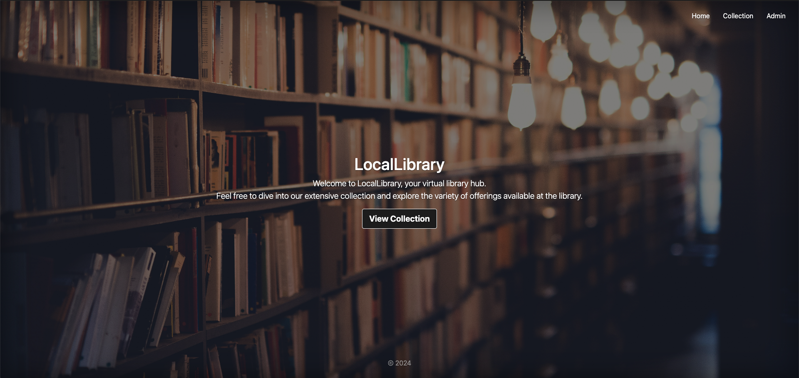

# LocalLibrary 



<!-- Live app: https://locallibrary-5sbd.onrender.com/ -->

## Introduction

Welcome to the LocalLibrary web application! This web app is designed to manage the resources of a local library, providing functionalities for both librarians and patrons to interact with the library's inventory and borrowing system.

## Table of Contents
- [Features](#features)
- [Technologies Used](#technologies-used)
- [Security](#security)
- [Acknowledgements](#acknowledgements)
- [Running Locally](#running-locally)

## Features

- **Book Catalog**: Browse available books.
- **Search**: Find books by title, author, genre, or ISBN.
- **Availability**: Check if a book is currently available for borrowing.
- **Management Interface**: Library staff can add, edit, or remove books, authors, genres, and instances from the library's catalog.
- **Passport Authentication**: Secure login system with Passport.js
- **Responsive Design**: Ensures compatibility across devices.

## Technologies Used

- **Frontend**: HTML, CSS, JavaScript, Bootstrap.
- **Backend**: Node.js (with Express.js) for server-side logic and Passport.js for authentication.
- **Database**: MongoDB (MongoDB Atlas for cloud-hosted MongoDB instances).
- **Version Control**: Git for version control, with GitHub for repository hosting.
- **Deployment**: Deployment on Render.

## Security

- Implement strict input validation to prevent injection attacks.
- Use Content Security Policy (CSP) to mitigate XSS attacks.
- Handle errors securely to avoid sensitive information exposure.
- Keep dependencies updated to address security vulnerabilities.

## Acknowledgements

- This project was inspired by the [MDN Web Docs](https://developer.mozilla.org/en-US/docs/Web) and their tutorials on building web applications.
- We'd like to thank the open-source community for their contributions to the technologies used in this project.

Happy Reading! 📚📖

## Running Locally

1. **Install MongoDB**.
2. **Create Accounts**:
   - Create a Cloudinary account to obtain an API key and secret code.
   - Create a Mapbox account to get an access token.
3. **Install Node**:
   - You can use the Node Version Manager (nvm) for installation.
4. **Clone Repository**:
<code>
git clone git@github.com:your-username/LocalLibrary.git
cd LocalLibrary
npm install
</code>

5. **SSH-Based Authentication** (optional):
- If using SSH-based authentication:
  ```
  git clone git@github.com:your-username/LocalLibrary.git
  ```
6. **Environment Variables**:
- Create a `.env` file or manually export variables in the terminal:
  ```
  cp sample.env .env
  ```
7. **Run the Application**:
- Open another terminal and run:
  - `mongod`
- Run the application:
  - `node app.js` or `nodemon app.js` if using nodemon.
- Access the application at `localhost:3000`.
