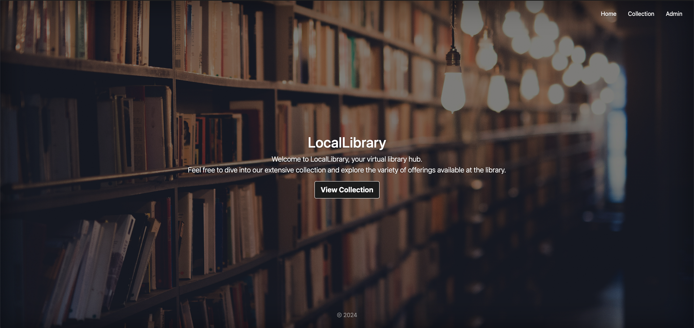

# LocalLibrary 



Live app: https://locallibrary-5sbd.onrender.com/

## Introduction

LocalLibrary is a web application designed to manage the resources of a local library, allowing both librarians and patrons to interact with the library catalog and borrowing system.

## Table of Contents
- [Features](#features)
- [Technologies Used](#technologies-used)
- [Security](#security)
- [QA Overview](#qa-overview)
- [Install Project](#install-project)
- [Contributing](#contributing)
- [Acknowledgements](#acknowledgements)

## Features

- **Book Catalog**: Browse available books.
- **Search**: Find books by title, author, genre, or ISBN.
- **Availability**: Check if a book is currently available for borrowing.
- **Admin Features**: Library admins can manage books, authors, genres, and instances. (Admin features only appear after sign-in)
- **Password Reset**: Library admins can reset their passwords securely.
- **Passport Authentication**: Secure login system with Passport.js
- **Responsive Design**: Ensures compatibility across devices.

## Technologies Used

- **Frontend**: HTML, CSS, JavaScript, Bootstrap.
- **Backend**: Node.js (with Express.js) for server-side logic and Passport.js for authentication.
- **Database**: MongoDB (MongoDB Atlas for cloud-hosted MongoDB instances).
- **Version Control**: Git for version control, with GitHub for repository hosting.
- **Deployment**: Deployment on Render.

## Security

- Implements strict input validation to help prevent injection attacks.
- Use Content Security Policy (CSP) to mitigate XSS attacks.
- Handle errors securely to avoid sensitive information exposure.
- Keep dependencies updated to address security vulnerabilities.

## QA Overview

This project uses a layered QA approach combining manual testing, API validation, and UI automation to validate core application workflows and reduce regressions.

Testing focuses on core user journeys rather than exhaustive edge-case coverage.

## Test Strategy

### 1. Manual Testing

Exploratory testing was used to understand application behavior and identify inconsistencies in navigation and search functionality.

### 2. API Testing (Postman)

Backend endpoints were tested independently of the UI to validate response structure, status codes, and basic reliability.

### 3. UI Automation (Playwright)

Automated tests focus on critical user workflows such as navigation, book details, and search functionality.

GitHub Actions is used to run tests on push and pull requests.

## Test Coverage

Testing focused on:

- Navigating the book catalog
- Viewing individual book details
- Searching by title (exact and partial matches)
- Validating book metadata display
- Basic API response validation for catalog and search endpoints

## Defects Found

**BUG-001: Empty Search Returns Full Catalog**

Empty search input returns the full catalog instead of showing a validation message or empty-state behavior.

**BUG-002: Full Author Search Inconsistency**

Full author name searches return no results, while partial author name searches succeed.

## Known Limitations

- Authentication and role-based access control were not fully tested in this project scope
- Testing focused primarily on publicly accessible catalog and search functionality
- Performance and security testing beyond basic checks were not performed

## Automation

UI automation is implemented using Playwright.

Coverage includes:

- Navigation between catalog and book detail pages
- Book metadata validation (title, author, ISBN, summary)
- Search functionality (exact and partial queries)

Automation is focused on stable, high-value workflows rather than exhaustive test coverage.

## Install Project

1. Clone the repository:

```bash
git clone https://github.com/jpdieter/LocalLibrary.git
```

2. Navigate to the project directory:

```bash
cd LocalLibrary
```

3. Install dependencies:

```bash
npm install
```

4. Create a `.env` file:

```bash
touch .env
```

5. Configure the following environment variables inside `.env`:

```env
DATABASE_URL=your_mongodb_connection_string
NODE_ENV=production
SECRET_KEY=your_secret_key
```

6. Start the development server:

```bash
npm run devstart
```

7. Open the application in your browser:

```text
http://localhost:3000
```

## Contributing
Contributions are welcome! If you'd like to contribute to the project, please fork the repository, make your changes, and submit a pull request.   

## Acknowledgements

- This project was inspired by the [MDN Web Docs](https://developer.mozilla.org/en-US/docs/Web) and their tutorials on building web applications.
- We'd like to thank the open-source community for their contributions to the technologies used in this project.