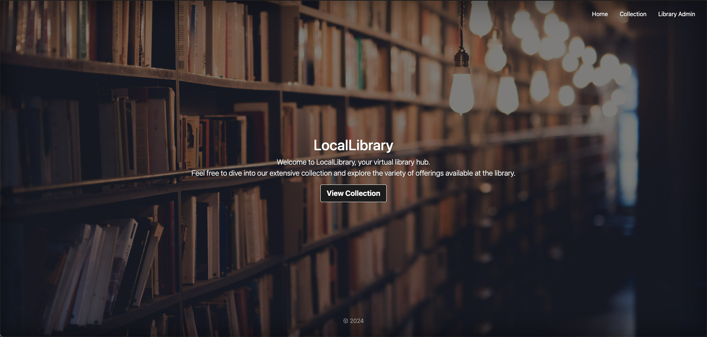

# LocalLibrary Web App

Live app: https://locallibrary-5sbd.onrender.com

Welcome to the LocalLibrary web application! This web app is designed to manage the resources of a local library, providing functionalities for both librarians and patrons to interact with the library's inventory and borrowing system.

## Table of Contents
- [Features](#features)
- [Technologies Used](#technologies-used)
- [Security](#security)
- [Acknowledgements](#acknowledgements)

## Features

- **Book Catalog**: Browse through a catalog of books available at the local library.
- **Search**: Search for books by title, author, genre, or other relevant criteria.
- **Availability**: Check the availability of a book to see if it's currently checked out or available for borrowing.
- **Borrowing Management**: Manage borrowing transactions, including check-out and check-in processes.
- **Passport Authentication**: Secure authentication system using Passport.js, allowing users to log in securely with username and password, ensuring access control to restricted functionalities and routes.

## Technologies Used

- **Frontend**: HTML, CSS, JavaScript.
- **Backend**: Node.js (with Express.js) for server-side logic and Passport.js for authentication.
- **Database**: MongoDB (MongoDB Atlas for cloud-hosted MongoDB instances).
- **Version Control**: Git for version control, with GitHub for repository hosting.
- **Deployment**: Deployment on Render.

## Security

- Implement strict input validation to prevent injection attacks (SQL injection, XSS).
- Use Content Security Policy (CSP) to mitigate XSS attacks by defining trusted sources.
- Handle errors securely to avoid exposing sensitive information.
- Keep dependencies updated to address security vulnerabilities.

## Acknowledgements

- This project was inspired by the [MDN Web Docs](https://developer.mozilla.org/en-US/docs/Web) and their tutorials on building web applications.
- We'd like to thank the open-source community for their contributions to the technologies used in this project.

Happy Reading! 📚📖
